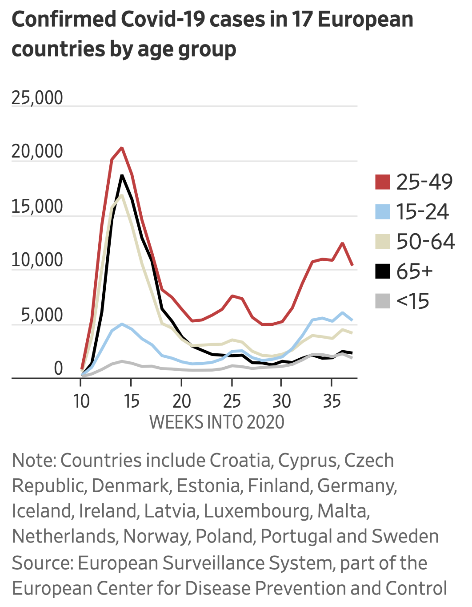

```{r setup, include=FALSE}
knitr::opts_chunk$set(echo = TRUE)
library(tidyverse)
library(utils)
library(magrittr)
```

## Overview

> *Describe the visualization you are creating at a broad overview level. What is the claim you are trying to make with it? What kind of data are you working with? etc.*

With this visualization, I am attempting to show the number of COVID cases in 17 European countries, broken down by specified age groups. Hopefully, we will be able to show the trends within each age group -- such as that younger individuals are responsible for more of the most recent COVID cases compared to the elderly people.

The claim I'm trying to make with it comes from a [WSJ article](
https://www.wsj.com/articles/europes-covid-fight-has-a-new-target-the-youth-11601553600). Specifically, the claim the article makes is that **"Younger people are driving the current surge in Covid-19 cases across Europe", supposedly due to parties and events with alcohol consumption.**

```{r my-screenshot, echo=FALSE}

```

The data I'll be working with comes from The European Surveilance System (TESSy), which is part of the European Center for Disease Prevention and Control (ECDC). Each data point consists of each country's weekly cases and deaths, for a given age group, gender, hospitalization status, intensive care status, and outcome. A somewhat interactive dashboard of this data can be found on [the ECDC's website](https://qap.ecdc.europa.eu/public/extensions/covid-19/covid-19-mobile.html#enhanced-surveillance-tab).

## Dataset

> *Your more detailed description of the dataset here. Where did it come from? What processing has happened to the data before you got it? etc.*

As stated earlier, the data comes from the ECDC's (COVID-19 Situation Dashboard)[https://qap.ecdc.europa.eu/public/extensions/covid-19/covid-19-mobile.html#enhanced-surveillance-tab]. Each row represents a group of people that all have the same country, age group, gender, hospitalization status, intensive care status, and outcome. This group of people's case number and death number is recorded.

Some information on how they collect and process COVID data can be found on (their website)[https://www.ecdc.europa.eu/en/covid-19/data-collection]. In short, the "a team of epidemiologists screens up to 500 relevant sources to collect the latest figures" from each country, and this data is added to the database. To get the data I'm working with, they have aggregated individuals based on their shared characteristics (age, country, gender, other statuses) and reported the counts.

```{r download-data, include=F, eval=F}
# data_filename <- "data/covid_data.csv"
# url <- "https://opendata.ecdc.europa.eu/covid19/casedistribution/csv"
# 
# if (!dir.exists("data"))
#   dir.create("data")
# if (!file.exists(data_filename)) {
#   download.file(url = url, destfile = data_filename)
# }
```

```{r load-data, include=F, eval=F}
# data_old <- read.csv('./data/covid_data.csv', na.strings = "", fileEncoding = "UTF-8-BOM")
# knitr::kable(head(data_old, 2))
```

```{r download-age-data}
data_filename_age <- "data/enhanced_surveillance_data.CSV"
data <- read.csv(data_filename_age)
```


> *Describe the structure of the data--size, shape, level of granularity, etc.*

In this data, there are `r nrow(data)` rows with `r ncol(data)` columns. Each of these columns is: `r names(data)`. This is a fairly *tidy* dataset, as it is long, not wide, and because each row only contains one observation.


## Wrangling

> *Describe, at a broad level, what you need to do to the data to make it into the form you need for the graph.*

This data is close to the form I'll need it in for my graph. However, some minor changes are outlined below:

- only include the 17 countries of interest  
- change data type of `cases` to "int" (but recode '<=10' values first)  
- change `Onset.week` to only the last two characters: the week number and reformat to number  
- discard data before week 10  
- remove unneeded columns  
- join/bind(?) data based on shared information (e.g., Week 15 cases for 65+ should be summed)  
- group all ages < 15 together  
- group all ages > 65 together  

```{r exclude-countries}
# Exclude countries
desired_countries <- c("Croatia", "Cyprus", "Czechia", "Denmark", "Estonia", "Finland",
                       "Germany", "Iceland", "Ireland", "Latvia", "Luxembourg", "Malta",
                       "Netherlands", "Norway", "Poland", "Portugal", "Sweden")
data <- data %>%
  filter(Reporting.country %in% desired_countries) %>%
  mutate(Reporting.country = factor(Reporting.country))
```

(? -- is there a better way to drop levels than just mutating with `factor`? I tried using `droplevels` but that wasn't seeming to work for me...)

```{r retype-cases}
# Retype cases
data <- data %>%
  mutate(
    Cases = as.character(Cases),
    Cases = if_else(Cases == '<=10', '1', Cases),
    Cases = as.numeric(Cases)
  )
```

```{r reformat-week}
# Reformat week
substrRight <- function(x, n){
  substr(x, nchar(x)-n+1, nchar(x))
}

data <- data %>%
  mutate(Onset.week = as.character(Onset.week)) %>%
  filter(Onset.week != "-") %>%
  mutate(
    Week2020 = substrRight(Onset.week, 2),
    Week2020 = as.numeric(Week2020)
  )
```

  
```{r exclude-early-data}
# Exclude early data
too_early <- c("2019-W51", "2020-W01", "2020-W03", "2020-W04", "2020-W05",
               "2020-W06", "2020-W07", "2020-W08", "2020-W09", "-")
data <- data %>%
  filter(!(Onset.week %in% too_early)) %>%
  mutate(Onset.week = factor(Onset.week))
```


```{r remove-columns}
# Remove unneeded columns
data <- data %>%
  select(Week2020, Cases, Age.group)
```

```{r join-sum-group-data, eval=F, include=F}
#(join & sum data)
#? Don't really know how to approach this...

#(group ages)
#? Don't really know how to approach this...
#- group all ages < 15 together  
#- group all ages > 65 together 

# just kidding!! I figured this out on HW7! See below:
```


## Visualization

```{r inital-plot-wrangling-attempt, eval=F, include=F}
# data %>%
#   group_by(Week2020, Age.group) %>%
#   summarize(n=n())
# 
# data %>%
#   group_by(Week2020) %>%
#   summarise(casecount=sum(Cases))
```


```{r plotting}
ggplot(data, mapping = aes(x = Week2020, y = Cases, color = Age.group )) +
  geom_line() +
  theme_bw() +
  labs(title = "Confirmed Covid-19 cases in 17 European countries \nby age group",
       y = "", x = "WEEKS INTO 2020", color = "",
       caption = "Note: Countries include Croatia, Cyprus, Czech Republic, Denmark, Estonia, Finland, Germany, \nIceland, Ireland, Latvia, Luxembourg, Malta, Netherlands, Norway, Poland, Portugal and Sweden \nSource: European Surveillance System, part of the European Center for Disease Prevention and Control") +
  theme(plot.caption = element_text(hjust = 0),
        plot.title = element_text(face = "bold"))

# join/sum/group, then feed into ggplot
data %>%
  arrange(Week2020, Age.group) %>%
  group_by(Week2020, Age.group) %>%
  mutate(confcases = sum(Cases)) %>%
  select(Week2020, Age.group, confcases) %>%
  distinct() %>%
  ggplot(mapping = aes(x = Week2020, y = confcases, color = Age.group )) +
    geom_line() +
    theme_bw() +
    labs(title = "Confirmed Covid-19 cases in 17 European countries \nby age group",
       y = "", x = "WEEKS INTO 2020", color = "",
       caption = "Note: Countries include Croatia, Cyprus, Czech Republic, Denmark, Estonia, Finland, Germany, \nIceland, Ireland, Latvia, Luxembourg, Malta, Netherlands, Norway, Poland, Portugal and Sweden \nSource: European Surveillance System, part of the European Center for Disease Prevention and Control") +
  theme(plot.caption = element_text(hjust = 0),
        plot.title = element_text(face = "bold"))
```

Notes from ending HW 6: I'm obviously not finished yet -- but I've got a good start on this, and that's all I can do for now. Next, I'd like to do the things that were unfinished above (join & sum, then group ages) [completed above in HW7]. Besides these wrangling tasks, I'm also hoping to figure out how to best show the lines (hopefully `geom_line` would just work once I complete the wrangling tasks) [HW7: it does!], match the colors using custom hex values from the original graph, specify the gridlines to match the original graph.

Additionally, it's kind of scaring me that there doesn't seem to be a huge spike around Week 15. The viz I'm copying shows this, so that's a bit concerning that my data doesn't seem to have this. Hopefully fixing those other things mentioned above would magically solve this problem, too? Otherwise, I can look into the potential of missing data... :(

To demonstrate the lack of a spike, here's my plot, but with bars...

```{r plotting-bars}
ggplot(data, mapping = aes(x = Week2020, y = Cases, fill = Age.group )) +
  geom_col(position = "dodge") +
  theme_bw() +
  labs(title = "Confirmed Covid-19 cases in 17 European countries \nby age group",
       y = "", x = "WEEKS INTO 2020", fill = "", 
       caption = "Note: Countries include Croatia, Cyprus, Czech Republic, Denmark, Estonia, Finland, Germany, \nIceland, Ireland, Latvia, Luxembourg, Malta, Netherlands, Norway, Poland, Portugal and Sweden \nSource: European Surveillance System, part of the European Center for Disease Prevention and Control") +
  theme(plot.caption = element_text(hjust = 0),
        plot.title = element_text(face = "bold"))
```


## Analysis

> ### *What help do you need to replicate the original visualization?*

After all these steps and attempting to recreate the visualization, I am realizing that my data is definitely incomplete, which I'm really sad about. I was excited to get as close as possible to the original graph, however, it appears that that is unlikely. I checked the datasource again and tried redownloading the data with different options, but to no avail. Because I've worked hard on this project so far, I'd like to propose a solution: I can still show my data wrangling & attempt at visualization, above, and then redo the plotting with manual data inputted by myself. For example, I'd do something like this:

```{r remake-data}
df <- c()
df$Week <- c(10:37, 10:37, 10:37, 10:37, 10:37)
df$Age <- rep(c('25-49', '15-25', '50-64', '65+', '<15'), each=28)
df$Case <- c(0, 5000, 13000, 20000, 21000, 18000,
             15000, 12000, 8000, 7500, 6000,
             5200, 5500, 6000, 6500, 7500,
             7300, 5800, 5000, 5100, 5300,
             6800, 8800, 11000, 11500,
             11000, 12500, 10500,
             rep(0, each = 28*4))
df <- data.frame(df)
```

```{r redo-graph}
ggplot(df, mapping = aes(x = Week, y = Case, color = Age )) +
  geom_line() +
  theme_bw() +
  labs(title = "Confirmed Covid-19 cases in 17 European countries \nby age group",
       y = "", x = "WEEKS INTO 2020", color = "",
       caption = "Note: Countries include Croatia, Cyprus, Czech Republic, Denmark, Estonia, Finland, Germany, \nIceland, Ireland, Latvia, Luxembourg, Malta, Netherlands, Norway, Poland, Portugal and Sweden \nSource: European Surveillance System, part of the European Center for Disease Prevention and Control") +
  theme(plot.caption = element_text(hjust = 0),
        plot.title = element_text(face = "bold"))
```

**If you'll let me do this,** I think this would be a good solution to the problem, as I've already spent a lot of time rewrangling and trying to get the right data from other online sources. I just don't think the data from TESSy/ECDC is publicly available :( But, I think my attempts above prove that I know how to wrangle data, use tidyverse/dplyr verbs, and think through the crucial data wrangling steps.


## Alternative Designs

> Refer to your Discussion 2 posts and replies from other students.  
What is a design choice that the original visual made (e.g., to use a particular aesthetic mapping or glyph)?  
What might be some reasonable alternative choices have been? Even if you don't think they would be good.

When I posted the visualization for Discussion 2, one thing that was mentioned was the need for a colorblind-friendly color scheme. This should be fairly easy to implement, using the viridis color palette, `scale_fill_viridis()`.

A design choice that the original visual made was was highlighting the "young people" category in red, and then 65+ category in black. I think this was intentional -- you can see as the weeks progress that the elderly, naturally at-risk population that we heard so much about at the beginning is responsible for less of the recent cases, and that the "young people" (aged 25-49) were on-par with 65+ at the beginning, but have *remained* alarmingly *(color: red)* high. This naturally draws your attention to the comparison of these two lines, which I think is really clever.

Aside from color, a design choice that the original visualization made was the grouping of ages. I was initially skeptical of the seemingly-odd groupings: why consider "young people" to be those aged 25 to 49 (25 years), while choosing to split up the other groups the way they are (into groups of 14, 10, 15...)? However, once I downloaded the data itself, I realized that these groupings were preselected by ECDC, and that this was the only form that the data had came in. Thus, it wasn't the WSJ's fault that the groupings are a bit odd. I was excited to explore the effect of more evenly spaced groupings, but unfortunately, this wouldn't be possible. An alternative design choice with the data at hand, though, would be to divide the case numbers by the total population in this age range. This would allow for a different view of the data, and should be fairly easy to look up (though it might be a bit tedious to do so for each of the 17 countries...). 

Another design choice made here was the decision to use a *line graph*, showing cases over time. Alternatively, a side-by-side bar graph `geom_col(position = 'dodge')` would've been made, with a set of 5 bars for each week, each individual bar representing an age group at the given week. However, I am glad WSJ decided to use a line graph -- not only does it seem to be the COVID plotting convention, but it also is uncluttered, easy to read, and allows for simple comparisons.

One last design choice that I'll mention here is that the y-axis is unlabelled. Joe mentioned this as a response to my forum post, and said that it "makes it difficult to understand upon a quick glance." I initially disagreed with him -- I thought the lack of a y-axis label made the graph look cleaner and I figured it was unnecessary. The title already includes the basics of the y-label: "Confirmed Covid-19 cases." With this title, the only thing missing from a y-axis label would be the units. The question then is: should the y units be included or not? Upon closer inspection, I'm realizing that either way would be valuable. If the goal is to simply compare COVID cases between age groups over time, then it's not imperative that the units of cases be reported. Yet, if we want as much clarity and insight (even unrelated to the direct aim of the graph) as possible, then I think it'd be beneficial to include a units label. Also, as Joe seemed to imply, some people don't read titles and skip directly to the graph itself, looking for axis labels to provide understanding. Because of this, it is maybe a better idea to include what is being measured (confirmed COVID-19 cases) on the axis, even if it appears a little more cluttered.

