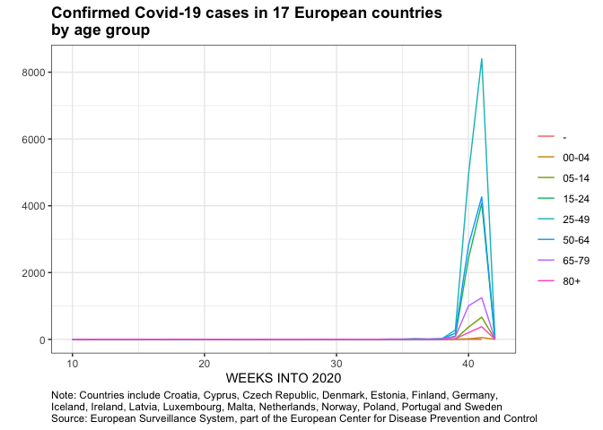
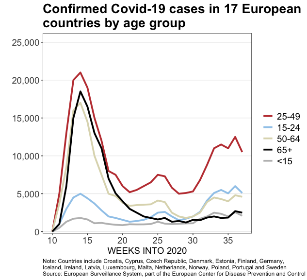
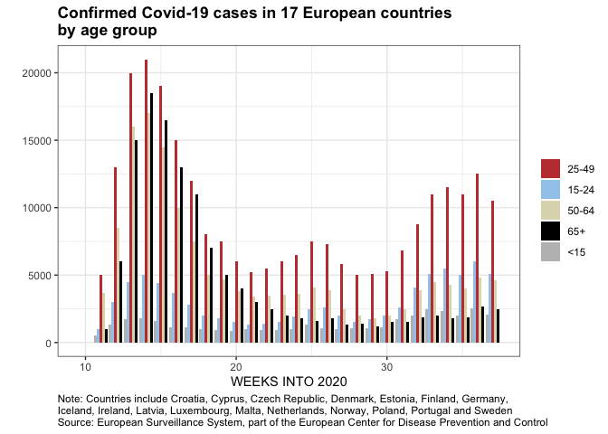
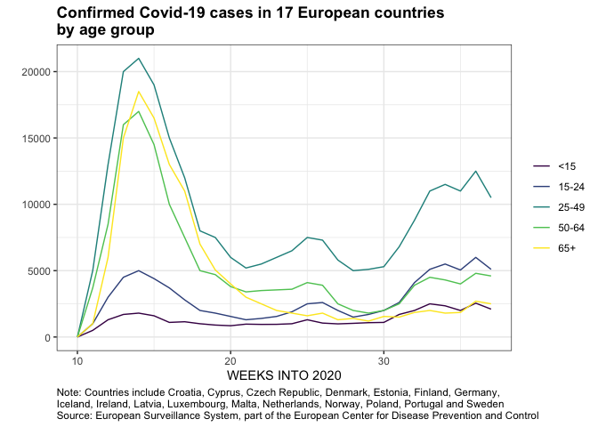

COVID Vis Reproduction & Predictive Modeling
================
Kaitlyn Westra
04 November 2020

Overview
--------

A [Wall Street Journal article](https://www.wsj.com/articles/europes-covid-fight-has-a-new-target-the-youth-11601553600), published on October 1, 2020, detailed the recent rise of COVID-19 cases in Europe. Compared to the earlier waves, recent cases seem to impact younger people. The authors pointed out that much of the spread seems to be due to parties, public gatherings, and other events where alcohol consumption takes place, leading governments to enact stricter guidelines.

The WSJ visualization, below, attempts to make the claim that **"younger people are driving the current surge in Covid-19 cases across Europe", supposedly due to parties and events with alcohol consumption.**


Design
------

The visualization chosen to display this data is a line graph, with the x-axis showing the 2020 Week Number, and the y-axis showing the number of cases in that week. The authors probably chose a line graph because it clearly shows the trend in cases over time, which makes it easy for the general viewer to understand. Besides the variables on the axes, the only other variable shown is the age grouping, which is displayed as the line color. This retinal variable of color was probably chosen because it simply and clearly breaks up the overall line into these distinct age categories. The specific color choices of red for the 25-49 age group, and black for the 65+ age group makes sense too, as those colors are the darkest / most saturated, allowing the viewer to make easy comparisons with those two data subsets.

Overall, the visual is effective in making most of its claim. From the viewer's perspective, because the red line has similar values to the black (65+) and beige (50-64) lines during weeks 10 - 17, it seems like it should follow this same trend in recent weeks as well. Yet this is not the case, and the fact that the red line is higher than the others in recent weeks makes this visualization pretty effective at "proving" its claim that young people make up recent Covid cases. However, I don't necessarily see a direct connection to parties and large gatherings from this data, and I think additional data would be needed to "prove" this part of its claim.

Though some parts of the claim are questionable, the graph effectively demonstrates that the make up of the age groups contributing towards COVID cases has changed over time, with people aged 25-49 making up the the majority of recent cases, as opposed to a more equal contribution in previous weeks. The choice to simply show these three variables -- week number, case count, and age group -- display the desired trend cleanly, without cluttering the rest of the graph with frivolous information. Additionally, this graph generally seemed avoid the common visualization pitfalls that were pointed out in [Claus Wilke's book](https://clauswilke.com/dataviz/), and I liked many of the design choices that were made. Even the color choices were well chosen, as the color differentiation held up in the anomalous trichromacy and dichromatic views of a color blindness simulator.

Dataset
-------

The data I'll be working with comes from The European Surveillance System (TESSy), which is part of the European Center for Disease Prevention and Control (ECDC) -- a reliable source because it's a trusted government agency. This is supposedly the dataset that the WSJ authors were working with; however, I ran into some problems (described later) that lead me to believe we were using different datasets. I thought I was able to get the original data, as I obtained it from the ECDC website, but perhaps this wasn't the case. To get my data, I went to the "Enhanced Surveillance Data" tab of COVID-19 Situational Dashboard on [the ECDC's website](https://qap.ecdc.europa.eu/public/extensions/covid-19/covid-19-mobile.html#enhanced-surveillance-tab). From there, I madee sure that no filters were applied, and downloaded the data using the green arrow at the top right of the page.

A statement on the ECDC's Copyright and Limited Reproduction Notices can be found on [their website](https://www.ecdc.europa.eu/en/copyright), but primarily, "information and documents made available on ECDC web pages... are public and may be reproduced, adapted and/or distributed, totally or in part... provided that ECDC is always acknowledged as the original source of the material." I was unable to find any specific names to credit for data processing, but some information on how they collect and process COVID data can be found on [their website](https://www.ecdc.europa.eu/en/covid-19/data-collection). In short, the "a team of epidemiologists screens up to 500 relevant sources to collect the latest figures" from each country, and this data is added to the database. To get the data I'm working with, they have aggregated individuals based on their shared characteristics (age, country, gender, other statuses) and reported the counts.

``` r
data_filename_age <- "data/enhanced_surveillance_data.CSV"
data_raw <- read.csv(data_filename_age)
```

In this dataset, each row consists of each country's weekly cases and deaths, for a given age group, gender, hospitalization status, intensive care status, and outcome. In this data, there are rows with columns. Each of these columns is: . This is a fairly *tidy* dataset, as it is long, not wide, and because each row only contains one observation. This makes it appropriate for the task at hand, and thankfully not much extreme tidying will be necessary.

Wrangling
---------

This data is close to the form I'll need it in for my graph. However, some minor changes are outlined below:

-   only include the 17 countries of interest
-   change data type of `cases` to "int" (but recode '&lt;=10' values first)
-   change `Onset.week` to only the last two characters: the week number and reformat to number
-   discard data before week 10
-   remove unneeded columns
-   join/bind(?) data based on shared information (e.g., Week 15 cases for 65+ should be summed)
-   group all ages &lt; 15 together
-   group all ages &gt; 65 together

``` r
# Exclude countries
desired_countries <- c("Croatia", "Cyprus", "Czechia", "Denmark", "Estonia",
                       "Finland", "Germany", "Iceland", "Ireland", "Latvia",
                       "Luxembourg", "Malta", "Netherlands", "Norway", "Poland",
                       "Portugal", "Sweden")
data_countries <- data_raw %>%
  filter(Reporting.country %in% desired_countries) %>%
  mutate(Reporting.country = factor(Reporting.country))
```

``` r
# Retype cases
data_format_cases <- data_countries %>%
  mutate(
    Cases = as.character(Cases),
    Cases = if_else(Cases == '<=10', '1', Cases),
    Cases = as.numeric(Cases)
  )
```

``` r
# Reformat week
substrRight <- function(x, n){
  substr(x, nchar(x)-n+1, nchar(x))
}

data_format_week <- data_format_cases %>%
  mutate(Onset.week = as.character(Onset.week)) %>%
  filter(Onset.week != "-") %>%
  mutate(
    Week2020 = substrRight(Onset.week, 2),
    Week2020 = as.numeric(Week2020)
  )
```

``` r
# Exclude early data
too_early <- c("2019-W51", "2020-W01", "2020-W03", "2020-W04", "2020-W05",
               "2020-W06", "2020-W07", "2020-W08", "2020-W09", "-")
data_exclude_early <- data_format_week %>%
  filter(!(Onset.week %in% too_early)) %>%
  mutate(Onset.week = factor(Onset.week))
```

``` r
# Remove unneeded columns
data <- data_exclude_early %>%
  select(Week2020, Cases, Age.group)
```

``` r
# Sum and group (aggregate) relevant data
aggregated_data <- data %>%
  arrange(Week2020, Age.group) %>%
  group_by(Week2020, Age.group) %>%
  mutate(confcases = sum(Cases)) %>%
  select(Week2020, Age.group, confcases) %>%
  distinct()
```

Visualization Replication
-------------------------

After wrangling, the visualization attempted yielded the following graph:

``` r
aggregated_data %>%
  ggplot(mapping = aes(x = Week2020, y = confcases, color = Age.group )) +
    geom_line() +
    theme_bw() +
    labs(title = "Confirmed Covid-19 cases in 17 European countries \nby age group",
       y = "", x = "WEEKS INTO 2020", color = "",
       caption = "Note: Countries include Croatia, Cyprus, Czech Republic, Denmark, Estonia, Finland, Germany, \nIceland, Ireland, Latvia, Luxembourg, Malta, Netherlands, Norway, Poland, Portugal and Sweden \nSource: European Surveillance System, part of the European Center for Disease Prevention and Control") +
  theme(plot.caption = element_text(hjust = 0),
        plot.title = element_text(face = "bold"))
```



Unfortunately, after all these steps and attempting to recreate the visualization, the dataset appears to be missing some data. Despite checking the datasource again and trying to redownload the data with different options, I was unable to get a dataset that contained all this data. Because of this, from this point onward, I will be using a manually created dataset, with the structure and values I would expect to see. **This was approved by Prof. Arnold**, because I spent a lot of time rewrangling and trying to get the right data from other online sources to no avail. However, I think my manually created dataset is a good solution to this missing data problem, and my attempts above prove that I know how to wrangle data, use tidyverse/dplyr verbs, and think through the crucial data wrangling steps.

### Manually creating dataset

``` r
df <- c()
df$Week <- c(10:37, 10:37, 10:37, 10:37, 10:37)
df$Age <- rep(c('25-49', '65+', '15-24', '50-64', '<15'), each=28)
df$Case <- c(0, 5000, 13000, 20000, 21000, 19000,
             15000, 12000, 8000, 7500, 6000,
             5200, 5500, 6000, 6500, 7500,
             7300, 5800, 5000, 5100, 5300,
             6800, 8800, 11000, 11500, 11000,
             12500, 10500, #end of 25-49
             0, 1000, 6000, 15000, 18500, 16500, #15
             13000, 11000, 7000, 5050, 4000, #@20
             3000, 2500, 2000, 1800, 1600, 
             1800, 1300, 1400, 1200, 1550,
             1500, 1850, 2000, 1800, 1850,
             2700, 2500, #end of 65+
             0, 1000, 3000, 4500, 5000, 4400,
             3700, 2800, 2000, 1800, 1550,
             1300, 1400, 1550, 1900, 2500, #25
             2600, 2000, 1500, 1700, 2000,
             2600, 4100, 5100, 5500, 5050, 
             6000, 5100, #end of 15-24!
             0, 3700, 8500, 16000, 17000, 14500,
             10000, 7500, 5000, 4700, 3800, #20
             3400, 3500, 3550, 3600, 4100,
             3900, 2500, 2000, 1800, 2000,
             2500, 3900, 4500, 4300, 4000,
             4800, 4600, #end of 50-64!
             0, 500, 1300, 1700, 1800, 1600,
             1100, 1150, 1000, 900, 850,
             970, 950, 955, 1000, 1300,
             1050, 990, 1030, 1080, 1100, 
             1700, 2000, 2500, 2350, 2000,
             2550, 2100) #<15
df <- data.frame(df)
```

``` r
ggplot(df, mapping = aes(x = Week, y = Case, color = Age )) +
  geom_line(size = 1.3) +
  scale_color_manual(values=c("#C13F3F", #red
                              "#A0CAEB", #blue
                              "#DEDABC", #beige
                              "#000000",  #black
                              "#BEBEBE" #grey
                              ),
                     breaks=c("25-49", "15-24", "50-64", "65+", "<15")) +
  theme_bw() +
  scale_x_continuous(breaks = seq(10, 35, 5), minor_breaks = 0) +
  scale_y_continuous(labels = scales::comma, minor_breaks = 0) +
  labs(title = "Confirmed Covid-19 cases in 17 European\ncountries by age group",
       y = "", x = "WEEKS INTO 2020", color = "",
       caption = "Note: Countries include Croatia, Cyprus, Czech Republic, Denmark, Estonia, Finland, Germany, \nIceland, Ireland, Latvia, Luxembourg, Malta, Netherlands, Norway, Poland, Portugal and Sweden \nSource: European Surveillance System, part of the European Center for Disease Prevention and Control") +
  coord_cartesian(ylim = c(950, 25000)) +
  theme(plot.caption = element_text(hjust = 0),
        plot.title = element_text(face = "bold", size = 20),
        legend.text = element_text(size = 14),
        axis.title.x = element_text(size = 14),
        panel.grid.major.x = element_blank(),
        axis.text = element_text(size = 14)
        )
```



Alternative Designs
-------------------

A design choice made here was the decision to use a *line graph*, showing cases over time. Alternatively, a side-by-side bar graph with `geom_col(position = 'dodge')` would've been made, with a set of 5 bars for each week, each individual bar representing an age group at the given week. This doesn't change the visual's ability to support its claim -- it still shows the same things. However, I am glad WSJ decided to use a line graph -- not only does it seem to be the COVID plotting convention, but it also is uncluttered, easy to read, and allows for simple comparisons. Yet, for the sake of demonstrating what this would look like, this visualization is produced below:

``` r
ggplot(df, mapping = aes(x = Week, y = Case, fill = Age )) +
    geom_col(position = "dodge") +
    scale_fill_manual(values=c("#C13F3F", #red
                                "#A0CAEB", #blue
                                "#DEDABC", #beige
                                "#000000",  #black
                                "#BEBEBE" #grey
                                ),
                       breaks=c("25-49", "15-24", "50-64", "65+", "<15")) +
    theme_bw() +
    theme_bw() +
    labs(title = "Confirmed Covid-19 cases in 17 European countries \nby age group",
       y = "", x = "WEEKS INTO 2020", fill = "",
       caption = "Note: Countries include Croatia, Cyprus, Czech Republic, Denmark, Estonia, Finland, Germany, \nIceland, Ireland, Latvia, Luxembourg, Malta, Netherlands, Norway, Poland, Portugal and Sweden \nSource: European Surveillance System, part of the European Center for Disease Prevention and Control") +
  theme(plot.caption = element_text(hjust = 0),
        plot.title = element_text(face = "bold"))
```



When I posted the visualization for Discussion 2, one thing that was mentioned was the need for a colorblind-friendly color scheme. This should be fairly easy to implement, using the viridis color palette, `scale_fill_viridis()`. Again, this doesn't change the graph's ability to support its claim as it's almost identical. But, it might help the colorblind members of WSJ's readership.

``` r
ggplot(df, mapping = aes(x = Week, y = Case, color = Age )) +
  geom_line() +
  theme_bw() +
  labs(title = "Confirmed Covid-19 cases in 17 European countries \nby age group",
       y = "", x = "WEEKS INTO 2020", color = "",
       caption = "Note: Countries include Croatia, Cyprus, Czech Republic, Denmark, Estonia, Finland, Germany, \nIceland, Ireland, Latvia, Luxembourg, Malta, Netherlands, Norway, Poland, Portugal and Sweden \nSource: European Surveillance System, part of the European Center for Disease Prevention and Control") +
  theme(plot.caption = element_text(hjust = 0),
        plot.title = element_text(face = "bold")) +
  viridis::scale_color_viridis(discrete = TRUE)
```



#### Discussion of other design choices:

A design choice that the original visual made was was highlighting the "young people" category in red, and then 65+ category in black. I think this was intentional -- you can see as the weeks progress that the elderly, naturally at-risk population that we heard so much about at the beginning is responsible for less of the recent cases, and that the "young people" (aged 25-49) were on-par with 65+ at the beginning, but have *remained* alarmingly *(color: red)* high. This naturally draws your attention to the comparison of these two lines, which I think is really clever.

Aside from color, a design choice that the original visualization made was the grouping of ages. I was initially skeptical of the seemingly-odd groupings: why consider "young people" to be those aged 25 to 49 (25 years), while choosing to split up the other groups the way they are (into groups of 14, 10, 15...)? However, once I downloaded the data itself, I realized that these groupings were preselected by ECDC, and that this was the only form that the data had came in. Thus, it wasn't the WSJ's fault that the groupings are a bit odd. I was excited to explore the effect of more evenly spaced groupings, but unfortunately, this wouldn't be possible. An alternative design choice with the data at hand, though, would be to divide the case numbers by the total population in this age range. This would allow for a different view of the data, and should be fairly easy to look up (though it might be a bit tedious to do so for each of the 17 countries...).

One last design choice that I'll mention here is that the y-axis is unlabelled. Joe mentioned this as a response to my forum post, and said that it "makes it difficult to understand upon a quick glance." I initially disagreed with him -- I thought the lack of a y-axis label made the graph look cleaner and I figured it was unnecessary. The title already includes the basics of the y-label: "Confirmed Covid-19 cases." With this title, the only thing missing from a y-axis label would be the units. The question then is: should the y units be included or not? Upon closer inspection, I'm realizing that either way would be valuable. If the goal is to simply compare COVID cases between age groups over time, then it's not imperative that the units of cases be reported. Yet, if we want as much clarity and insight (even unrelated to the direct aim of the graph) as possible, then I think it'd be beneficial to include a units label. Also, as Joe seemed to imply, some people don't read titles and skip directly to the graph itself, looking for axis labels to provide understanding. Because of this, it is maybe a better idea to include what is being measured (confirmed COVID-19 cases) on the axis, even if it appears a little more cluttered.

Summary
-------

After having undergone the entire proceess, my understanding of the article's claim has remained unchanged. I still agree that the number of recent COVID cases among 25-49 year-olds is proportially higher than it was during the "first wave" of COVID. This trend was seen despite the different graphs using this dataset.

Although my first replication was unfruitful, I think the replication with my fake datset was pretty good. I tried to get as close as I could to the WSJ visualization, and I think I did that pretty well. Obviously, my replication isn't the same due to the fact that it uses completely different data (my manual dataset instead of real ECDC/TESSy data), but besides the data differences, I tried to replicate design similarities, and I came close to this.

My alternative designs were also pretty successful -- they looked the way I wanted them to, and demonstrated how changing small aspects of the visualization didn't affect the ability of this data to support the claim.

Some potential ethical questions that arise from this process are related to the context of this graph. Yes, it *does* appear that Europe's recent COVID cases are made up of a different age demographic than the first wave -- with this new wave involving a higher proportion of those aged 25-49. However, this article's assertion that these numbers were due to partying and public events attended by this younger demographic may be a bit of a stretch. I think this article's focus on partying and alcohol consumption being the primary reasons why young people are being infected may be overstepping the bounds of this data. Is it possible that young people are working in jobs that involve more interactions with other people? Are there other reasons (beyond parties / alcohol) that younger people make up more of the recent positive cases? I think there is more to be considered, so I was disspointed that they used only this data to support their claim -- I think it would be better if the article included supporting evidence on the number of people who got infected from parties, etc. Additionally, I'd want to know what the testing situation was like in the earlier weeks compared to the more recent weeks. If the way that tests were distributed / used was different at the beginning than now, I'd wonder what effect that has on the numbers as well.

The major preessing question I have about this data and visualization is simply, "Why is the data I downloaded missing data?" and "How did WSJ get access to the complete dataset?" Though this question will probably never be answered, it's interesting to think about why this could be.

I honestly don't see this extending into a final project. I'd personally love to explore a different dataset for the final project. Besides that, though, I don't think much predictive modelling can be done from the data used here, so I'd say this pretty much seems like a dead end.

I feel good about this overall experience; besides the overall frustration with missing data, I generally enjoyed this project.
